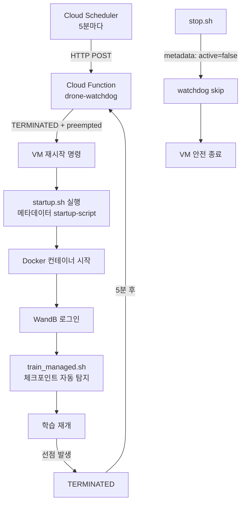

# 연구 일지 — 2026-04-23

---

## 오늘 한 일

### 1. Spot VM 무인 학습 자동화 인프라 구축 (2026-04-21 ~ 04-23)

기존 온디맨드 VM에서 **Spot VM + Cloud Function + startup.sh** 구조로 전면 이전.
선점(preemption) 발생 시 사람 개입 없이 학습이 자동 재개되는 파이프라인 완성.

- **`infra/startup.sh`** — VM 부팅 시 GCP 메타데이터 startup-script로 자동 실행
  - Docker 데몬 대기 → VNC 대기 → xhost 설정 → 컨테이너 시작
  - WandB API 키 자동 로그인 (`/opt/drone-bombard/.wandb.env`)
  - GPU 확인 → `train_managed.sh` 위임 (체크포인트 자동 탐지 + 학습 재개)
  - 완료 후 메타데이터 `drone_training_active=true` 설정

- **`infra/watchdog/main.py`** — Cloud Function (Gen2)
  - Cloud Scheduler가 **5분마다** HTTP POST로 트리거
  - 3중 안전장치: `TERMINATED` 상태 + `drone_training_active=true` + 마지막 zone operation이 `preempted`인 경우에만 재시작
  - cooldown 15분, 연속 재시작 3회 이상 시 중단 + Cloud Logging 경고

- **`infra/deploy.sh`** — 일회성 인프라 배포 스크립트
  - STEP 0: us-central1-a L4 GPU 가용성 확인
  - STEP 1: 기존 디스크를 신규 Spot VM에 이전 (`us-central1-c` → `us-central1-a`)
  - STEP 2: Service Account 생성 + IAM 권한 부여
  - STEP 3: Cloud Function 배포
  - STEP 4: Cloud Scheduler 등록 (5분 간격)
  - STEP 5: startup-script VM 메타데이터 등록

- **`infra/create_spot_vm.sh`** — L4 Spot VM 멀티존 자동 재시도 생성
  - GPU 재고 없을 시 `us-central1-a/b/c/f → asia-northeast3-a/b/c` 순으로 폴백
  - 성공한 존으로 Cloud Function 환경변수 자동 업데이트

- **`infra/stop.sh`** — 수동 안전 종료 스크립트
  - `drone_training_active=false` 메타데이터 먼저 해제 → watchdog 재시작 방지 → VM 종료

### 2. startup.sh WandB 자동 로그인 추가 (2026-04-23)

기존 startup.sh에 **[4-1] WandB 자동 로그인** 단계 추가.
Spot VM은 재시작마다 신선한 컨테이너 상태이므로 매번 `wandb login` 필요.
`/opt/drone-bombard/.wandb.env`에 API 키를 저장해두고 startup.sh가 읽어서 주입.

### 3. 새 VM 셋업 + IP 변경 대응 (2026-04-23)

- **IP 변경:** 구 IP `136.113.193.83` → 신 IP `130.211.241.166`
  - `/opt/drone-bombard/guacamole-stack/nginx.conf` 업데이트
  - SSL 인증서 새 IP SAN으로 재발급 (10년 self-signed)
  - nginx 컨테이너 재시작
  - `notes/Environment/nginx.conf` 백업 + `notes/Environment/README.md` IP 전수 교체

---

## 주요 결정 & 발견

> [!success] Spot VM 자동화 아키텍처 확정
> `startup.sh` (VM 측) + `watchdog/main.py` (Cloud Function) + `stop.sh` (수동 제어)의 3-계층 구조로 선점 → 자동 재시작 루프 완성. 사람 개입 없이 야간 학습 가능.

> [!info] 디스크 이동의 효과
> 기존 온디맨드 VM에서 Spot VM으로 디스크를 이동했더니 Docker 이미지, ROS2 빌드, WandB `.netrc`, Claude Code 설정 **모두 그대로 보존**됨. 재설치 불필요.

- **3중 안전장치 설계 이유:** 단순 `TERMINATED` 체크만으로는 수동 종료도 재시작됨 → `drone_training_active` 메타데이터 플래그로 의도적 종료를 구분
- **cooldown 15분 이유:** startup.sh 완료까지 ~10분 소요 → 연속 선점 시 무한 재시작 방지
- **멀티존 폴백 이유:** L4 Spot VM은 특정 존에서 재고 부족이 잦음 → `create_spot_vm.sh`가 자동으로 다른 존 시도
- **WandB 자동 로그인 추가 이유:** 컨테이너 내부 `.netrc`는 디스크 이동으로 보존되지만, Spot VM 재생성 시 컨테이너가 새로 만들어지는 경우를 대비

---

## 코드 변경 사항

| 파일 | 변경 내용 |
|------|----------|
| `infra/startup.sh` | VM 부팅 자동화 전체 + [4-1] WandB 자동 로그인 단계 추가 |
| `infra/stop.sh` | 수동 안전 종료 (watchdog 재시작 방지 + metadata 해제) |
| `infra/watchdog/main.py` | Cloud Function — 선점 감지 + 3중 안전장치 자동 재시작 |
| `infra/watchdog/requirements.txt` | `google-cloud-compute`, `functions-framework` |
| `infra/deploy.sh` | 일회성 GCP 인프라 배포 (VM 마이그레이션 + CF + Scheduler) |
| `infra/create_spot_vm.sh` | 멀티존 L4 Spot VM 자동 생성 + CF 환경변수 업데이트 |
| `notes/Environment/nginx.conf` | `server_name` IP 업데이트 (136→130) |
| `notes/Environment/README.md` | 모든 IP 참조 일괄 교체, Spot VM 운영 가이드 추가 |
| `/opt/drone-bombard/guacamole-stack/nginx.conf` | 실제 서비스 설정 IP 업데이트 |
| `/opt/drone-bombard/guacamole-stack/ssl/nginx.*` | SSL 인증서 + 키 재발급 |

---

## 시스템 아키텍처 (Spot VM 자동화)

---

## 문제 & 해결

| 문제 | 해결 여부 | 메모 |
|------|----------|------|
| 새 VM IP(`130.211.241.166`)로 Guacamole HTTPS 접속 불가 | ✅ | nginx.conf `server_name` + SSL SAN 업데이트 후 nginx 재시작 |
| VM 내부에서 `curl https://130.211.241.166` 타임아웃 | ✅ (정상) | GCP VM은 자신의 외부 IP로 self-접속 불가 — `localhost`로는 `301` 정상 응답 확인 |
| Spot VM 재생성 시 WandB 인증 초기화 | ✅ | startup.sh [4-1]에 `.wandb.env` 기반 자동 로그인 추가 |
| 수동 종료 후 watchdog이 VM을 다시 켜는 문제 | ✅ | `stop.sh`로 `drone_training_active=false` 먼저 해제 후 종료 |

---

## VM 환경 최종 상태 (2026-04-23 기준)

| 항목 | 상태 | 비고 |
|------|------|------|
| NVIDIA L4 GPU | ✅ | Driver 535.288.01 |
| Docker | ✅ | 5개 컨테이너 전부 Up |
| TigerVNC :1 | ✅ | 5901 포트 LISTEN |
| Guacamole 스택 | ✅ | HTTP→HTTPS 리다이렉트 정상 |
| ROS2 + rl_navigation | ✅ | colcon build 결과 그대로 |
| WandB 로그인 | ✅ | startup.sh 자동 로그인 + 컨테이너 내 `.netrc` 보존 |
| gcloud auth | ✅ | `nachoigpt@gmail.com` 인증 유지 |
| Claude Code + RTK 0.36.0 | ✅ | hooks 설정 그대로 |
| Obsidian AppImage | ✅ | `~/Applications/Obsidian.AppImage` |
| **Spot VM 자동화** | ✅ | startup.sh + watchdog CF + Scheduler 전부 배포 완료 |

---

## 내일 할 일

- [ ] **Exp 002 시작 전 config 수정** — `hyperparams_rtf2.yaml`에서 `run_name`, `tags`, `total_timesteps`(1M), `checkpoint_dir` 변경
- [ ] **colcon build 확인** — Phase 1 obs 15→17 변경이 컨테이너에 반영되어 있는지 확인
- [ ] **Exp 004 dry-run** — obs[15-16] WandB에서 non-zero 확인 (`env/mean_d_impact`)
- [ ] dry-run 성공 후 → **Exp 005a 야간 학습** (1M steps, fresh start, RTF=2, Spot VM 무인 실행)
- [ ] Spot VM으로 야간 학습 시작 후 watchdog 첫 선점 대응 동작 확인

---

## 관련 노트

- [[Environment/README]] — VM 완전 복구 가이드 (IP 130.211.241.166, Spot VM 운영 가이드 포함)
- [[research/rl_rules]] — RTF=2 확정 규칙
- [[experiments/exp_002_reward_shaping_patches]] — 다음 학습 대상
- [[daily/daily_2026-04-17]] — Phase 1 코드 구현 (obs 15→17)
