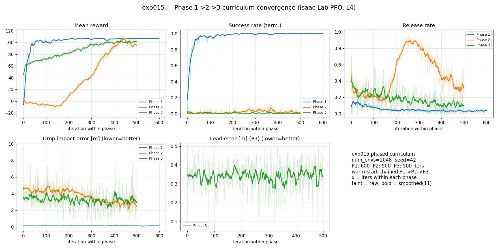

# exp_015 — Phase별 순차 커리큘럼 학습 (CCIP+Residual → 이동타겟)

> 이미지의 3단계 커리큘럼(접근/nominal → CCIP+Residual/정지타겟 → 이동타겟)을 Isaac Lab
> env + 순차 학습 `train.py`로 **완전 구현**. 사용자 확정: residual = **액션 스페이스
> 확장(4→6)**. 이 노트는 코드 구현 기록(미학습) — 학습/튜닝은 L4 VM에서.

관련: [[experiments/exp_014_A2_visionrange]] · [[experiments/exp_012_isaac_migration_phase2]] · [[research/phased_curriculum]] · [[research/isaac_lab_architecture]] · [[research/rl_rules]]

---

## 1. 목표 & 설계 결정

exp_014까지의 Phase 1(접근/nominal release, 정지타겟)은 eval 100%로 검증됨. exp_015는
그 위에 2·3단계를 **실제로 작동시키는** env 로직과 순차 학습 오케스트레이터를 얹는다.

- **액션 6차원 고정 (전 페이즈 동일).** `action[0:4]`=ENU 속도 setpoint(vx,vy,vz,yaw),
  `action[4:6]`=CCIP 착탄점 residual(δx, δy). 이유: rsl_rl 네트워크 아키텍처가 페이즈 간
  동일해야 `runner.load()` warm-start가 **무손실**. Phase 1은 env가 `action[4:6]`을 무시
  (`residual_enabled=False`)해 exp_014 접근 태스크와 동작 동일. (기존 4-dim exp_014
  체크포인트는 6-dim으로 대체 — Phase 1 from scratch 재학습.)
- **페이즈는 `DroneBombardEnvCfg.phase`(1/2/3) 단일 노브**로 제어, 파생 플래그
  (`residual_enabled`/`dr_enabled`/`moving_target_enabled`/`release_enabled`)를 phase에서 유도
  (cfg `__post_init__` + env `__init__` 양쪽 — train.py가 cfg 생성 후 phase를 세팅하므로
  env에서 재유도).
- **순차 학습 = 서브프로세스 오케스트레이션.** Isaac Sim은 프로세스당 1 sim만 안전 →
  `train.py --phases 1,2,3`은 각 페이즈를 `train.py --phase N --resume <이전 final.pt>`
  서브프로세스로 실행하고 `model_final.pt`를 다음 페이즈 warm-start로 체이닝.

## 2. 페이즈별 동작

| 항목 | 1단계 (접근/nominal) | 2단계 (CCIP+Residual, 정지) | 3단계 (이동타겟) |
|---|---|---|---|
| 탄도 모델 | nominal(정확) | nominal + **model mismatch**(drag `U[0,0.15]`·wind `N(0,1.5)` DR) | 2단계 + 타겟 속도(Gauss-Markov) |
| Residual | 없음(action[4:6] 무시) | **도입** — CCIP 예측 + δ·`residual_scale`(3m) | 유지 + lead 예측 보정 |
| Release 트리거 | 없음(성공=근접) | \|예측착탄 − 타겟\| ≤ `release_tolerance`(0.5m) | lead 타겟(target+vel·t_fall) 기준 동일 |
| 보상(terminal) | proximity `reward_success`(100) | 실제 낙하(DR) 착탄오차 → `w_impact·exp(-err/scale)` | 좌동 + lead 예측 정확도 `w_lead·exp(-lead_err/scale)` |
| 새로 배우는 것 | 진입 고도/속도/헤딩 | 모델 불확실성 보정(항력·바람) | 요격기하 / 리드 |
| weight 인계 | from scratch | 1단계 `model_final.pt` warm-start | 2단계 `model_final.pt` warm-start |

**릴리스 메커니즘 (2·3단계):** 매 policy step, 온보드 예측 = `predict_impact_nominal`(drag/wind
무시) + `apply_ccip_residual`(정책 δ). 예측이 lead 타겟 tol 내이고 고도 > `min_release_altitude`면
`_released` 래치 + 실제 낙하 `ballistic_impact`(DR 주입)로 진짜 착탄오차 산출 → 그 스텝 종단.
성공 = 릴리스 & `real_err ≤ success_impact_radius`(0.8m). 릴리스 없이 timeout → `no_release_penalty`.

## 3. 코드 변경 (커밋 예정)

- `isaac_lab/drone_bombard/math_utils.py`: `time_to_fall`, `predict_impact_nominal`,
  `apply_ccip_residual`, `step_target_velocity`(OU/Gauss-Markov), `impact_terminal_reward`,
  `lead_prediction_reward` 신설. `ccip_residual` zero-stub는 하위호환 유지.
- `isaac_lab/drone_bombard/mdp/domain_rand.py`: `sample_drag_coefficient`/`sample_wind`에
  `enabled` 플래그(Phase 2+ 비영), `sample_target_velocity` 신설(Phase 3).
- `isaac_lab/drone_bombard/drone_bombard_env.py`: `action_space=6`, `phase` + 파생 플래그 +
  `DroneBombardPhaseCfg`, 6-dim 액션 파이프라인(속도 rate-limit/LPF + residual 분리),
  `_advance_phase_dynamics`/`_evaluate_release`(릴리스), 이동타겟 GM 적분, `_get_dones`/
  `_get_rewards` 페이즈별 종단·보상, `_reset_idx` DR/타겟속도/릴리스 버퍼, 로깅
  (`release_rate`·릴리스 실제 `drop_impact_error_m`·`lead_error_m`).
- `isaac_lab/train.py`: `--phase`/`--phases`/`--phase_iterations`/`--final_out` — 단일 페이즈
  in-process + 다중 페이즈 서브프로세스 오케스트레이터(warm-start 체이닝).
- 보조 스크립트(`play.py`/`record_episode.py`/`yolo_eval.py`/`_diag_kick.py`) 액션 차원 6 대응.
- `isaac_lab/tests/test_math.py`: 신규 순수-torch 유닛테스트 8종(time_to_fall/nominal/residual/
  GM/impact·lead 보상/drag 브랜치).

## 4. 검증 (2026-07-05 완료 ✅)

- **`pytest test_math.py` 38/38 PASS** — CPU torch(2.12.1+cpu) venv 로컬 실행. 기존 30 + 신규 8
  (time_to_fall/predict_impact_nominal/apply_ccip_residual/step_target_velocity ×2/impact·lead 보상/
  drag 브랜치) 전부 통과.
- **로컬 `py_compile` 전체 통과**(math_utils, domain_rand, env, train, 보조 5종 포함 9파일).
- **Isaac Sim + Isaac Lab 실학습 스모크 3페이즈 전부 통과** (`isaac-verify` 컨테이너,
  `isaac-lab-local:580`, NVIDIA L4, headless):
  | 테스트 | 명령 | 결과 |
  |---|---|---|
  | Phase 1 | `--phase 1 --num_envs 16 --max_iterations 2` | ✅ model_0/1/final.pt + tfevents 생성 |
  | Phase 2 (warm-start) | `--phase 2 ... --resume <p1 final>` | ✅ `model_2.pt`(iter 카운터 2에서 이어짐=warm-start 무손실 로드 증명) + final |
  | Phase 3 (warm-start) | `--phase 3 --num_envs 32 --max_iterations 3 --resume <p2 final>` | ✅ `Learning iteration 2/5`, `[Done]`, 신규 지표 로깅 확인 |
  | Orchestrator | `--phases 1,2 --phase_iterations 1,1` | ✅ 서브프로세스 체이닝, `[INFO] Warm-starting from <p1 final>`, `Curriculum complete`, 두 final.pt 생성 |
- **오케스트레이터 전체 커리큘럼 1→2→3 자동 전환 검증 완료** (`--phases 1,2,3
  --phase_iterations 20,20,20 --num_envs 64 --headless`, `isaac-verify`, ORCH_EXIT=0, ~3분):
  - Phase 1→2→3 세 페이즈 모두 진입(`[Orchestrator] === Phase N (N/3) ===`)
  - 체이닝: Phase 2 `Warm-starting from ...phase1_final.pt`, Phase 3 `...phase2_final.pt`
  - 각 페이즈 `[Done] Phase N final model ... saved` + `_phase{1,2,3}_final.pt` 3개 생성
  - `[Orchestrator] Curriculum complete. Final checkpoint: ...phase3_final.pt`
  - **페이즈별 지표 분기 실증**: Phase 1 = `drop_impact_error_m`만(해석적 CCIP, release 없음),
    Phase 2 = `release_rate`(0~1.0)+`drop_impact_error_m`(실제 DR 낙하), Phase 3 = 거기에
    `lead_error_m`(0.11~0.49) 추가. → `release_enabled`/`moving_target_enabled` 파생 플래그가
    페이즈마다 올바르게 동작함을 확인.
- **신규 env 로직 실증 (Phase 3 단독 스모크 로그)**: `release_rate` 0→**1.0**→0(릴리스 이벤트 발화),
  `drop_impact_error_m` 3.85/6.82/2.50(실제 낙하 착탄오차 산출), `lead_error_m` 0.098/0.44/0.43
  (이동타겟 lead 지표 로깅). 미학습 상태라 mean reward는 음수(정상 — release miss 페널티).
- **구조적 한계(문서화)**: `run_orchestrator`가 서브프로세스 cmd에 `--livestream`/`PUBLIC_IP`를
  **전달하지 않음** → 오케스트레이터 전체 커리큘럼은 headless 전용, 화면 스트리밍 불가.
  화면 관찰이 필요하면 단일 `--phase N --livestream 1`로 실행해야 함(후속: 오케스트레이터에
  livestream passthrough 추가 가능).
- **비고**: 이 dev 박스 host python엔 torch/pytest 부재 → pytest는 CPU torch venv를 임시 부트스트랩해
  실행(테스트 후 정리). 실학습 검증은 컨테이너 안 `isaaclab.sh -p`로 수행(로그 경로는 컨테이너
  write 권한상 `/tmp/...` 사용).

## 5. L4 VM 실행 절차 (문서화 — 미실행)

```bash
# 1) 스모크 (phase 1, 2 iters)
./isaaclab.sh -p /workspace/drone-bombard/isaac_lab/train.py \
  --phase 1 --headless --num_envs 16 --max_iterations 2
# 2) 페이즈별 스모크 (릴리스/DR/이동 경로 점검)
./isaaclab.sh -p .../train.py --phase 2 --headless --num_envs 16 --max_iterations 2
./isaaclab.sh -p .../train.py --phase 3 --headless --num_envs 16 --max_iterations 2
# 3) 순차 커리큘럼 dry-run
./isaaclab.sh -p .../train.py --phases 1,2,3 --headless --num_envs 256 \
  --phase_iterations 5,5,5
# 4) 본 학습
./isaaclab.sh -p .../train.py --phases 1,2,3 --headless --num_envs 2048 \
  --phase_iterations 3000,2000,2000
```

## 6. 리스크 / 후속 (튜닝 TODO)

- **릴리스·터미널 보상 도입 = 태스크 재정의** → 2·3단계는 fresh warm-start이나 보상 재설계이므로
  성능 재검증 필수(첫 롤아웃 후 `release_rate`·`drop_impact_error_m` 확인). Rule 20 참조.
- **MLP 정책은 단일 obs에서 타겟 속도를 추론 불가** → 3단계 lead는 현재 env가 해석적으로 계산
  (aim = target + vel·t_fall)하고 residual/보상이 그 위에서 작동. **진짜 정책-학습 lead를 원하면
  obs에 타겟 속도 2채널 추가(14→16)** 가 후속 과제(문서화).
- `PhaseCfg` 값(residual_scale, drag_max, wind_std, release_tolerance, GM theta/sigma,
  intercept_tau, w_impact/w_lead)은 전부 **초기 추정** — L4 dry-run 신호로 튜닝.
- stagnation guard가 타겟 위 hover-대기(d_xy 정체)를 오탐할 수 있음 → 릴리스 지연 시 감시.

## 7. 실제 학습 결과 (2026-07-12 — 베이스라인 커리큘럼 완주 ✅)

> **첫 end-to-end 실학습.** exp_015 원본 커리큘럼(plain `--phases 1,2,3`, `--release_terminal`·
> `--w_aim` **미사용** — exp_018 종단 재구조/exp_017 dense 조준 개입 없는 순수 베이스라인)을
> L4에서 완주. → 새 발견: [[research/curriculum_phase_convergence]]

### 7.1 학습 설정

| 항목 | 값 |
|---|---|
| 명령 | `isaaclab.sh -p train.py --phases 1,2,3 --phase_iterations 600,500,500 --num_envs 2048 --headless --logger tensorboard --seed 42 --log_root /tmp/exp015_orch --run_name exp015` |
| 컨테이너 | `isaac-verify` (`isaac-lab-local:580`, NVIDIA L4 23 GB, headless) |
| Throughput | **~2.3 s/iter (≈27–29 K steps/s)**, num_steps_per_env=32 → 65 536 steps/iter |
| 소요 시간 | Phase 1 ~23 min · Phase 2 ~21 min · Phase 3 ~20 min → **전체 ~65 min** (sim 런치 3회 포함) |
| 완주 | `[Orchestrator] Curriculum complete` + **ORCH_EXIT=0** ✅ |
| 예산 조정 | **없음** — 첫 iter throughput(~2.3 s)이 빨라 기본 600/500/500·2048 그대로 유지(전체 <1.5 h 예상 충족) |

> **주의(범위):** 이 run은 exp_015가 정의한 **원본 릴리스 메커니즘**(Phase 2·3에서 nominal CCIP+δ
> 예측이 tol 내이면 래치→실제 DR 낙하 착탄오차 터미널 보상, 성공 = 릴리스 & real_err ≤ 0.8 m)을
> 그대로 학습한 것. exp_018의 `release_terminal`(발화=종단 +100) 구조는 **미적용**.

### 7.2 페이즈별 수렴 (initial → final; final/init = tail-mean 20 iter)

| 지표 | Phase 1 (접근/nominal) | Phase 2 (CCIP+Residual+DR, 정지) | Phase 3 (이동타겟, lead) |
|---|---|---|---|
| Mean reward | **36.8 → 106.9** (peak 107.3) | **−0.8 → 94.7** (peak 115.0) | **57.0 → 101.7** (peak 108.0) |
| Success rate (term.) | **0.48 → 1.00** ✅ | 0.001 → 0.01 (peak 0.14) | 0.019 → 0.008 (peak 0.12) |
| Release rate | — (Phase 1 릴리스 없음) | 0.33 → 0.32 (peak **0.98**) | 0.35 → 0.10 (peak 0.71) |
| Drop impact error [m] ↓ | 0.13 → 0.13 (해석적 CCIP, DR 없음) | **4.66 → 2.91** ↓ (best 0.37) | 3.47 → 3.20 (best 0.24, 노이즈) |
| Lead error [m] ↓ | — | — | 0.344 → 0.336 (best **0.071**) |
| ittime (mean) | 2.27 s | 2.49 s | 2.34 s |

**샘플링 수렴 곡선 (iteration 별, phase-local):**

Phase 1 (n=600): `-21.4 →(it60) 103.3/succ0.97 →(it300) 106.4/succ1.00 →(it599) 106.8/succ1.00`
Phase 2 (n=500): `reward 11.8 →(it125) -6.3 →(it250) 29.8 →(it450) 110.7 →(it499) 91.9`; `drop 4.10 → 3.60 → 3.14 → 1.76 (하락)`; `release 0.63 → 0.22 → 0.86 → 0.15 (변동)`
Phase 3 (n=500): `reward 20.2 →(it250) 89.0 →(it375) 107.0 →(it499) 98.9`; `lead 0.338 → 0.415 → 0.199`; `drop 3.61 → 1.04(it375) → 3.80`



### 7.3 정직한 평가

- **Phase 1 — 완전 수렴 ✅.** success 0.48→**1.00**, reward saturate(~107). exp_014 접근 태스크
  eval 100%를 재현. 해석적 CCIP `drop_impact_error_m`은 DR가 없어 ~0.13 m로 안정(투하 아님, 조준 정확도).
- **Phase 2 — 방향성 신호 O, 성공은 미달 (추가 학습 필요).** warm-start로 접근 능력 보존 →
  태스크 재정의(DR+릴리스)로 reward가 일시 하락(−0.8) 후 ~150 iter 내 **94.7로 회복**;
  `drop_impact_error_m` **4.66→2.91 m 하락 추세**(best 0.37). release_rate는 tail-mean ~0.33
  (peak 0.98)로 **변동성 큼**. 그러나 success ~0 — DR 하의 착탄오차(~2.9 m)가 성공 반경 0.8 m보다
  훨씬 커서 릴리스가 명중으로 이어지지 않음.
- **Phase 3 — 가장 약한 수렴 (추가 학습/튜닝 필요).** reward는 ~102로 강하게 회복,
  `lead_error_m`이 순간 **0.071 m**까지 내려가나 tail-mean은 ~0.34로 사실상 평탄, release_rate는
  0.10으로 하락. 이동타겟 + 500 iter 예산으로는 lead 수렴 신호가 뚜렷하지 않음.
- **종합:** reward 우상향은 **접근/proximity 보상 스트림이 지배**(warm-start가 보존) — 릴리스-종단
  임무 능력(sub-0.8 m 명중)은 이 베이스라인 구조에서 500 iter로는 형성되지 않는다.
  → exp_016(근접 정책은 릴리스 윈도우를 거의 못 통과)·exp_017(보상-단독 개입 실패)의 결론을
  **커리큘럼 전체(2048 envs)에서 재확인**. 이를 뚫는 알려진 해법은 exp_018의 **릴리스=종단 구조**
  (미적용). 상세: [[research/curriculum_phase_convergence]].

### 7.4 산출물 / 위치

- **체크포인트**(각 1.7 MB, host 영속화 완료): `/opt/drone-bombard/isaac-worktree/logs/exp015_orch/exp015_phase{1,2,3}_final.pt`
  (컨테이너 원본 `/tmp/exp015_orch/…`, `isaac-verify` up 동안 유지).
- **stdout 전체 로그**(파싱 소스): 같은 폴더 `train_stdout.log` (2.9 MB) — rsl_rl가 매 iter Mean reward/
  success/release_rate/drop_impact_error_m/lead_error_m를 텍스트로 출력.
- **파싱/플롯 스크립트 + 추출물**: `parse_metrics.py`, `plot_curves.py`, `metrics_phase{1,2,3}.csv`,
  `summary.json`, 그래프 `notes/experiments/exp015_convergence.png`.
- **TensorBoard**: 컨테이너 `/tmp/exp015_orch/drone_bombard_ppo/2026-07-12_*_exp015_phase{1,2,3}/`.

## 8. 이어학습(2차) — P2/P3 extended (+2000 iters each, 2026-07-13 ✅)

> §7 baseline 완주 후 **동일 체크포인트에서 페이즈별 단독 연장 학습**. exp_018
> `release_terminal`·exp_017 `--w_aim` **미적용**(베이스라인 구조 유지). 목적: 500 iter
> 예산 부족 가설 검증 — P2/P3에 각 +2000 iter 추가 시 sub-0.8 m 명중 돌파 여부.

### 8.1 학습 설정

| 항목 | P2 extended | P3 extended |
|---|---|---|
| 컨테이너 | `isaac-verify` (L4, headless) | 동일 |
| resume | `exp015_phase2_final.pt` (1차 P2 종료, iter 1098) | `exp015_phase2_ext_final.pt` (2차 P2 종료, iter 3097) |
| `--phase` / `--max_iterations` | 2 / 2000 | 3 / 2000 |
| global iter 범위 | 1098 → 3097 | 3097 → 5096 |
| num_envs | 2048 | 2048 |
| 완주 | **P2_EXIT=0** ✅ | **P3_EXIT=0** ✅ |
| 소요 시간 | ~1.5 h (P2 ext) | ~1.5 h (P3 ext) |

### 8.2 1차 vs 2차 비교표 (tail-mean 20 iter 기준)

| 지표 | 1차 P2 (500 it) | 2차 P2 ext (+2000) | 1차 P3 (500 it) | 2차 P3 ext (+2000) |
|---|---|---|---|---|
| Mean reward | **94.7** | **107.7** ↑ | **101.7** | **74.5** ↓ |
| Success rate | ~0 (0.01) | **0.0** | ~0 (0.008) | **0.0** |
| Release rate | 0.32 (tail) | **0.01** ↓↓ | 0.10 | **0.013** ↓ |
| Drop impact error [m] ↓ | **4.66 → 2.91** | **2.87** (best_min **0.008**) | 3.47 → 3.20 | **5.31** ↑ (best_min 0.094) |
| Lead error [m] ↓ | — | — | 0.336 (best **0.071**) | 0.347 (best_min 0.016) |

**Δ 요약 (2차 − 1차 tail):**
- **P2 ext:** drop 2.91→2.87 m — **미미한 개선**(0.04 m), best_min 0.008 m 스파이크 있으나 success 여전히 0.
  release_rate는 0.33→**0.01**로 **급락**(던지기 빈도 감소·근접 최적화 경향 강화).
- **P3 ext:** drop 3.20→**5.31 m 회귀**, reward 101.7→**74.5** 하락, release 0.10→0.013.
  lead tail 평탄(0.34→0.35) — 이동타겟 수렴 신호 없음.

### 8.3 수렴 평가

- **0.8 m 돌파: ❌ 미달.** 전 구간 success final_mean20 ≈ 0. DR 하 착탄오차 tail은 P2 ~2.9 m,
  P3 ext ~5.3 m로 성공 반경(0.8 m) 밖.
- **P2 extended:** drop 하한 ~2.87 m에서 **정체**(1차 2.91 m와 실질 동급). +2000 iter로
  **0.04 m** 개선에 그침. best_min 0.008 m는 단발성 스파이크(지속 수렴 아님).
- **P3 extended:** **악화** — 이동타겟+추가 iter만으로는 lead/drop 개선 없음, 오히려
  release_rate·reward 동반 하락.
- **결론:** 베이스라인 커리큘럼에서 **iter 예산 확대만으로는 릴리스-종단 명중 능력을 형성 못 함**.
  §7 판정 재확인 — exp_018 `release_terminal` 종단 재구조가 필요. 상세: [[research/curriculum_phase_convergence]] §2(e).

### 8.4 산출물 (host)

경로: `/opt/drone-bombard/isaac-worktree/logs/exp015_cont/`

| 파일 | 설명 |
|---|---|
| `p2_stdout.log` / `p2_exit.txt` | P2 ext 학습 로그 (P2_EXIT=0) |
| `p3_stdout.log` / `p3_exit.txt` | P3 ext 학습 로그 (P3_EXIT=0) |
| `exp015_phase2_ext_final.pt` | P2 ext 체크포인트 (iter 3097) |
| `exp015_phase3_ext_final.pt` | P3 ext 최종 체크포인트 (iter 5096) |
| `summary_p2_ext.json` / `summary_p3_ext.json` | 파싱 요약 (`parse_cont.py`) |
| `metrics_p2_ext.csv` / `metrics_p3_ext.csv` | iter별 시계열 |
| `pipeline_done.txt` | 파이프라인 완료 타임스탬프 |
| `parse_cont.py` | stdout 파서 |

---

## 관련 노트
- [[research/phased_curriculum]] — 설계·수식·warm-start 원리 (Rule 20 근거)
- [[research/curriculum_phase_convergence]] — **(07-12) 실학습 수렴 특성·warm-start 효과·릴리스 갭 (신규)**
- [[experiments/exp_014_A2_visionrange]] — Phase 1 baseline (eval 100%)
- [[experiments/exp_016_ccip_release_reeval]] — 근접≠릴리스 (Rule 21) / [[experiments/exp_018_release_terminal]] — 릴리스=종단 해법 (Rule 23)
- [[experiments/exp_012_isaac_migration_phase2]] — env/parity 이식 (Phase-2 훅 최초 wiring)
- [[research/rl_rules]] Rule 20 / [[00_index]]
