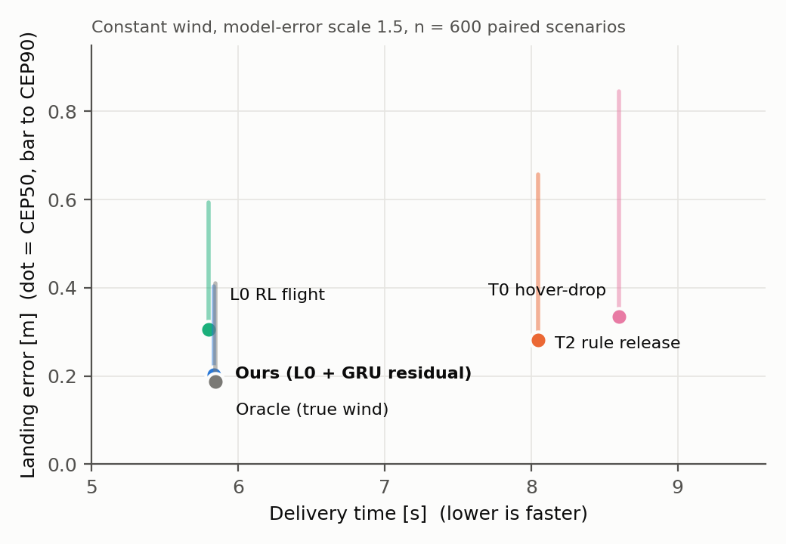
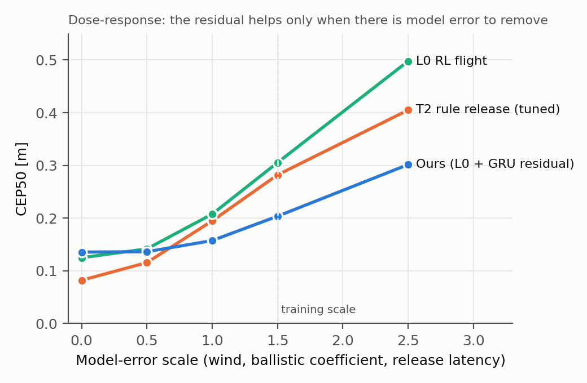
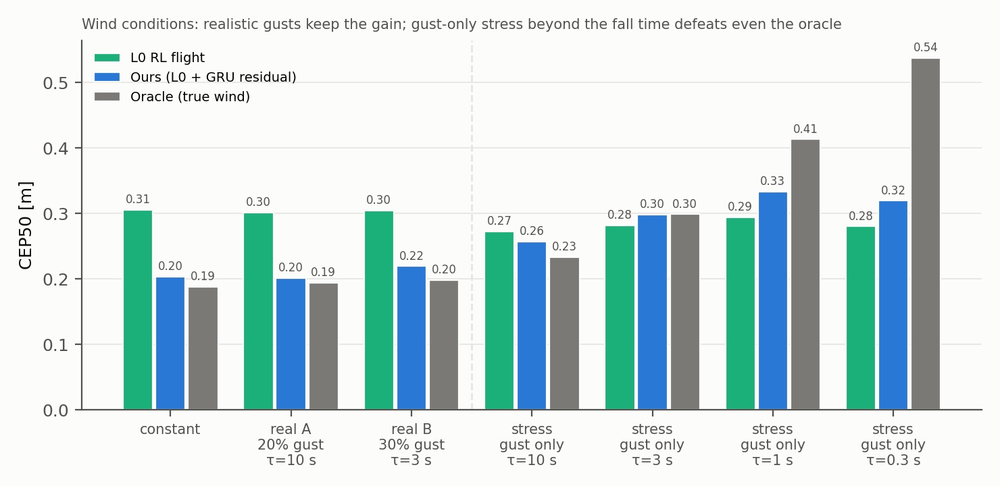

# 최종 표·그림 v6 — 본 방법 = L0 + GRU 잔차 (GRU-S)

> 모든 표는 같은 600 시나리오(eval seed 3000·4000·5000 × 200 paired)이며, 수치의 원본 JSON은 컨테이너 `/tmp/{sl_GI,gru,dr_axis,sl_R,gust,ou,t_reseed,sweep3}`,
> 그림은 `isaac_lab/_fig_final.py`로 생성(`notes/figures/`). 개요는 [[research/paper_outline_v6]].

## 그림

| 파일 | 내용 |
|---|---|
| `figures/fig1_speed_accuracy.png` | 배달 시간–착지 오차 평면(점 = CEP50, 막대 = CEP90까지), 정상 바람 |
| `figures/fig2_dr_sweep.png` | 모델 오차 세기 스윕: T2(튜닝)·L0·본 방법의 CEP50 (용량-반응) |
| `figures/fig3_wind.png` | 바람 조건별 CEP50: 정상 / 현실 A·B / 돌풍만 스트레스 τ 사다리 |

## Table 1 — 정상 바람, 모델 오차 세기 1.5

| 팔 | 배달률 | 배달시간 s | CEP50 m | CEP90 m | succ@1.0 | succ@0.5 | 투하 속도 m/s |
|---|---|---|---|---|---|---|---|
| T0 정지 투하 | 77.5% | 8.60 | 0.335 | 0.844 | 72.3% | 53.5% | 0.31 |
| T2 규칙 릴리즈 (튜닝) | 78.5% | 8.05 | 0.282 | 0.656 | 77.0% | 65.0% | 1.39 |
| L0 강화학습 비행 | 94.5% | 5.80 | 0.305 | 0.593 | 93.8% | 78.8% | 3.45 |
| **본 방법: L0 + GRU 잔차** | **94.7%** | 5.84 | **0.204** | **0.403** | **94.7%** | **90.8%** | 3.45 |
| 오라클 (참 바람) | 94.7% | 5.84 | 0.188 | 0.411 | 94.7% | 91.8% | 3.45 |

강화학습 비행이 배달률·시간·투하 속도를, 잔차가 정확도를 가져온다. 오라클 이득의 86%(CEP50 기준) 회수.

## Table 2 — 모델 오차 세기 스윕 (CEP50 m; succ@0.5)

| 세기 | T2 (튜닝) | L0 | **본 방법** | 잔차 효과 (vs L0) |
|---|---|---|---|---|
| 0 (오차 없음) | 0.082 (87.7%) | 0.125 (94.0%) | 0.136 (94.3%) | +8.8% (해롭다) |
| 0.5 | 0.116 (88.2%) | 0.142 (93.8%) | 0.136 (94.2%) | −4.2% |
| 1.0 | 0.195 (83.3%) | 0.208 (92.2%) | 0.157 (93.5%) | −24.5% |
| 1.5 (학습 조건) | 0.282 (65.0%) | 0.305 (78.8%) | **0.204 (90.8%)** | **−33.1%** |
| 2.5 (미학습) | 0.405 (39.2%) | 0.498 (45.0%) | **0.302 (70.3%)** | **−39.4%** |

오차가 없으면 튜닝된 규칙이 가장 정확하고 잔차는 손해다(제거할 편향 없이 분산만 더함). 오차가 커질수록 효과가 단조 증가하고
세기 0.5~1.0 사이에서 부호가 뒤집힌다. 미학습 세기 2.5에서 효과가 가장 크다.

## Table 3 — 바람 조건 (CEP50 / CEP90 / succ@0.5, 괄호 = ΔCEP50 vs L0)

| 조건 | L0 | **본 방법** | 오라클+EMA |
|---|---|---|---|
| 정상 (비행마다 다른 평균풍) | 0.305 / 0.593 / 78.8 | **0.204 / 0.403 / 90.8 (−33%)** | 0.188 / 0.411 / 91.8 |
| 현실 A: 평균풍 + 20% 돌풍, τ=10 s | 0.301 / 0.578 / 77.8 | **0.201 / 0.408 / 90.8 (−33%)** | 0.194 / 0.388 / 91.5 |
| 현실 B: 평균풍 + 30% 돌풍, τ=3 s | 0.305 / 0.593 / 77.0 | **0.219 / 0.420 / 88.3 (−28%)** | 0.198 / 0.420 / 90.3 |
| 스트레스: 돌풍만, τ=10 s | 0.272 / 0.578 / 79.7 | 0.257 / 0.527 / 83.7 (−5.5%) | 0.234 / 0.526 / 84.8 |
| 스트레스: 돌풍만, τ=3 s | 0.282 / 0.569 / 79.8 | 0.298 / 0.601 / 77.5 (+5.7%) | 0.299 / 1.092 / 65.8 |
| 스트레스: 돌풍만, τ=1 s | 0.294 / 0.567 / 78.7 | 0.333 / 0.795 / 68.8 (+13%) | 0.413 / 1.313 / 55.2 |
| 스트레스: 돌풍만, τ=0.3 s | 0.280 / 0.555 / 80.5 | 0.319 / 0.616 / 73.7 (+14%) | 0.538 / 1.318 / 44.5 |

현실적인 돌풍(저고도 Dryden 수준)에서는 이득이 그대로 유지된다. 돌풍만 남기고 세기를 평균풍 수준으로 둔 스트레스 조건에서
상관 시간이 낙하 시간(0.85 s)에 가까워지면 참 바람을 아는 오라클도 진다 — 문제 자체의 한계. 보조 변형(실현 라벨 + 분산 헤드)은
그 구간의 손해를 절반으로 줄인다(τ=1: +13% → +9%) → [[experiments/exp_036_uncertainty_head]].

## Table 4 — 일반화 (미학습 사거리 26–30 m, 정상 바람)

| 팔 | CEP50 | CEP90 | succ@0.5 | ΔCEP50 |
|---|---|---|---|---|
| L0 | 0.299 | 0.617 | 60.7% | — |
| **본 방법** | **0.211** | **0.428** | **70.3%** | **−29.4%** |
| 오라클 | 0.204 | 0.409 | 69.8% | −31.7% |

학습·적합은 18–22 m에서만 했다. 회수율 93%(오라클 대비).

## Table 5 — Ablation (정상 바람, CEP50; 무엇을 빼면 무엇이 무너지나)

| 뺀 것 | 결과 | 출처 |
|---|---|---|
| 잔차 전체 (= L0) | 0.204 → 0.305 | Table 1 |
| 학습 필터 → 손 설계 누적 특징 + MLP | 0.209 (동등) — 손 설계 불필요 | [[experiments/exp_034_learned_temporal_filter]] |
| 출력 평활(EMA 0.3) | 0.462 (2배 악화) — 첫 교차 게이트의 요동 편향 | [[experiments/exp_028_l1_sl_pilot]] |
| 정답 수 1,000 → 100 에피소드 | 이득 96% → 잔차가 손해 (CEP90 +43%) | [[experiments/exp_029_l1_sl_generalization]] |
| 관측 이력 → 순간 관측만 (MLP 26ch) | 0.329 — L0보다 나쁨 | [[experiments/exp_028_l1_sl_pilot]] |
| (보조 변형) 실현 라벨 + 분산 헤드, 스트레스 τ=1 | +13% → +9% | [[experiments/exp_036_uncertainty_head]] |

## 팔 정의

| 팔 | 비행 | 조준 | 학습 |
|---|---|---|---|
| T0 | 목표 위에 정지 | 공식 예측 | 없음 |
| T2 | 정속 통과, 공식 예측 최소점 릴리즈, 투하 고도 3.5 m 튜닝 | 공식 예측 | 없음 |
| L0 | PPO 정책(2048 envs × 1000 iter) | 공식 예측 | 강화학습 |
| 본 방법 | L0 동결 | 공식 예측 + GRU 잔차(관측 26ch 이력 → 드리프트, 정상 바람 3,000 ep로 지도학습, EMA 0.3) | 강화학습 + 지도학습 |
| 오라클 | L0 동결 | 공식 예측 + 참 바람 드리프트(+EMA) | 상한선 |
